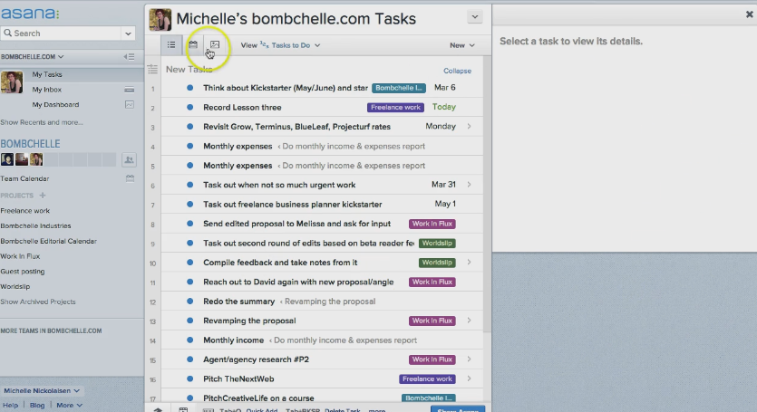
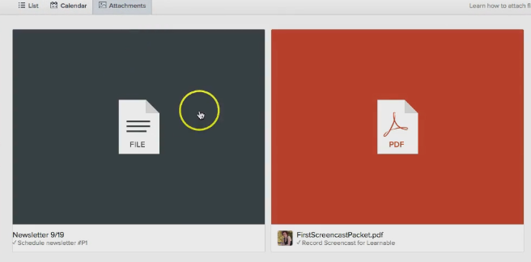
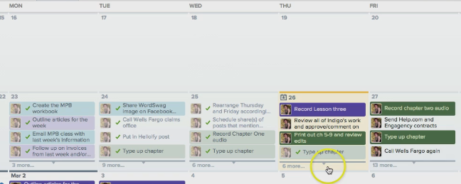

# Introduction

At this step we're going to talk about Asana, which is my personal favorite.

# Overview of Asana

Asana is really flexible and powerful. You can keep it simple or you can go more complex. It's free for teams of up to 15 people, so this is really great for freelancers and solopreneurs.

It also has iOS and Android apps. I can't speak for Android, but the iOS apps are very-well designed, they are very easy to use and I really like them.

# Potential deal breakers of Asana

Asana could be overkill for teams of just one person or for people who only have one or two projects to keep track of or for people who don't want project management trappings. So if you don't actually need to add comments on tasks or attach files and all those additional features clutters your workspace, then Asana is probably not for you.

The other thing is that clients aren't as familiar with Asana. However I think it's still very easy to get used to it, especially if you have even a minimum level of tech proficiency. So, I don't think it should completely deter you from using Asana but that is something to think about if you want to have all your client communication in there.

# Best uses of Asana

The best uses for Asana in my opinion are if you have a lot of projects to keep track of and if you're a visual thinker or you want to be able to switch back and forth between visual and linear views.

# Explore Asana

So this is my Asana set up. You can see the list and it's color coded.

You can change the view here to recently completed tasks or tasks by project or tasks by due date.

There is a special tab to show all of the attachments. Asana has built-in integration with Dropbox and Google Drive.

This is how calendar view look like. You can add tasks by email, you can print it, you can sync to an outside calendar.