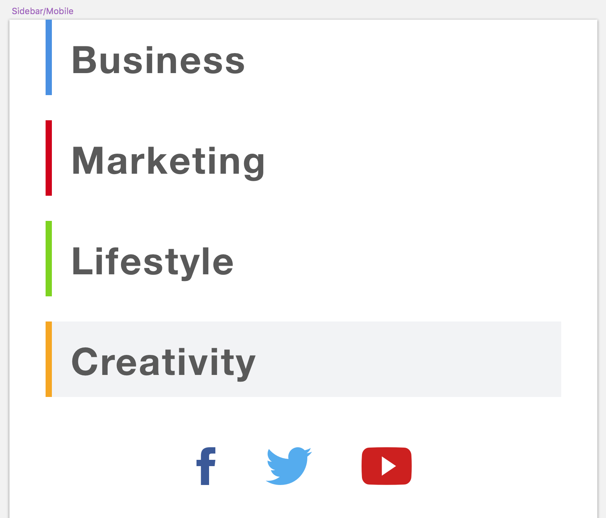
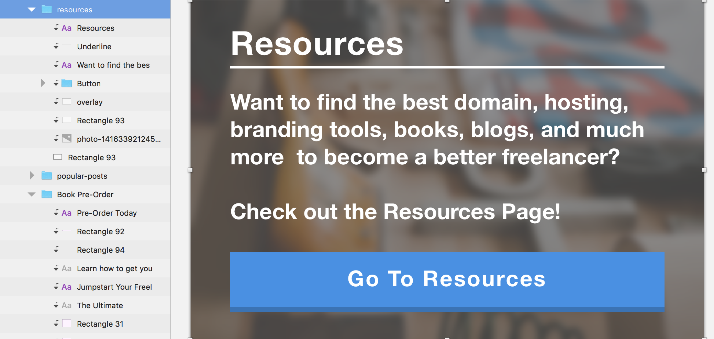
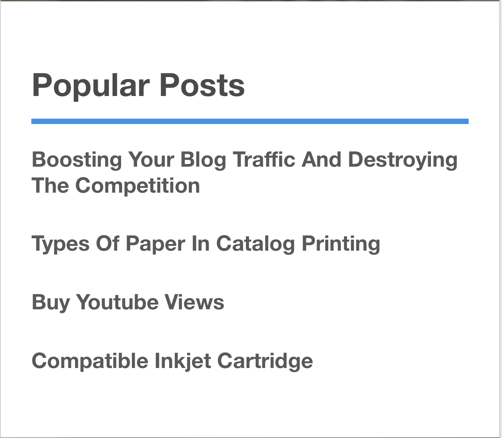

# Designing the Content Areas for Mobile

In this section, we'll create the content areas (or sidebar widgets) for mobile screens. While they will be part of the sidebar on desktop and tablet screen sizes, they'll be full-width content areas below the blog section on a mobile screen size.

### Categories
We'll create the catoegories section, and keep one of the categories daker to show an active state.

### Social Icons
We'll use Ionicons to paste in social icons. For this project, we'll be using Facebook, Twitter, and Instagram. We'll also use the correct brand colors for every icon, which you can find at http://brandcolors.net/

### Resources

For creating the resources component, we'll create a content box with multiple layers, in the following order (from top to bottom):
- Text and Button
- Overlay layer with a dakr gray fill and 65% opacity
- Blur Layer - A rectangle without fill and a background blur checked on with a 2px radius
- Photo layer
- Container layer.
- 

Once you've arranged all of these in order, group them in a group called "Resources" and right click on the container layer, and click on use as mask.

### Popular Posts
The Popular posts widget consists of a widget title, and article titles. For the Popular Post title, use the stye "H2" that we created earlier, and then put a underline rectabgle with a 4px height and a "banner" style, and place it 8px below the title. For the Article Titles, use a text with 16px size and a bold weight, and create the text style named "Popular-Post", and space them 24px between each other, with the top one 16px below the underline banner.

### Freelance Guide
The Freelancer Guide Widget will be designed similarly to that of the Resources widget. The main differences here will be the text being used.

To finish off, we'll group together the sidebar content widgets and convert it into a symbol and name it "Sidebar/Mobile".

