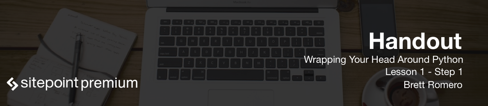

# What Is Python?

Welcome to Wrapping Your Head Around Python course! My name is Brett Romero.

**Python language** is easy to read, so it's a great language for learning. Python is a general purpose language - this means you can do a lot of things with Python. It's used quite a bit for web development, but there are many different things that you can do with it besides just web development.

Python is an interpreted language - you don't have to worry about compiling your code into some kind of executable and then running the executable with some kind of other runtime environment.

# An Interpreted Language

So, this means that the code is kind of compiled on the fly. All you have to do is basically create a code file and it's just going to execute.

For example, in a web environment where you're using Python for your server, you'll have Python installed on the server. You'll have your code files andas your code files are executed, they're interpreted. You don't have to worry about compiling them down into any kind of byte code.

As I mentioned earlier, Python is great for learning programming. So we're going to see why it's great for learning programming, and there's really not a lot to it in regards to complex syntax and that's one of the reasons why it's easy to learn. With Python, the indentation is one of the most important things. We'll see how that works but there's no ending symbols that you'll need at the of a line, like a semicolon or a period or anything like that. The syntax is fairly easy, which makes the language really readable.